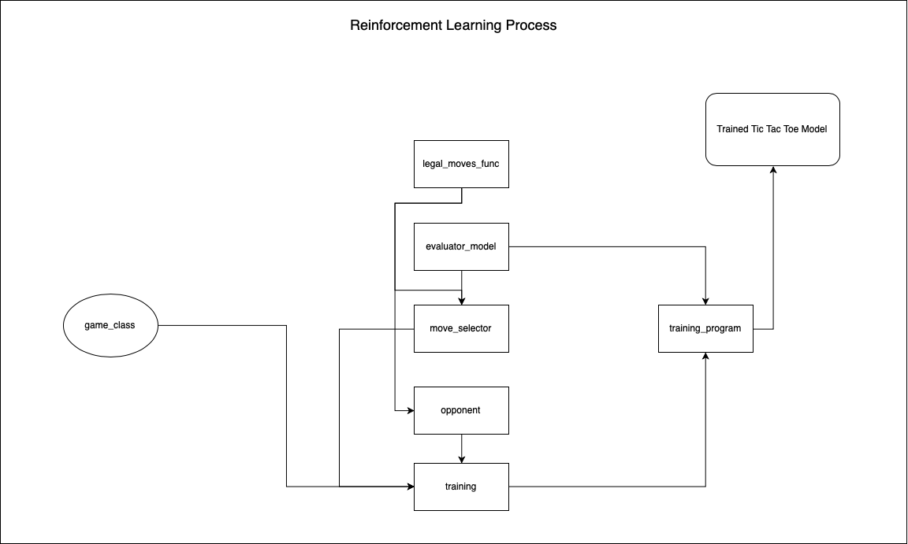
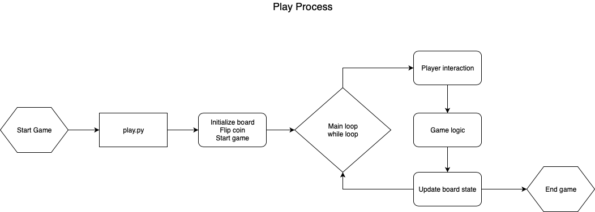
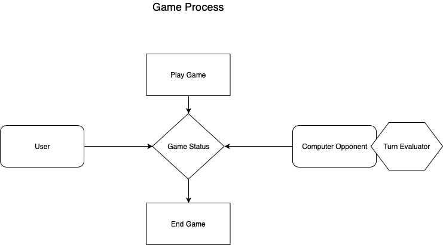

# Pet Project for Advanced Software Engineering WS 2018/19

My pet project for Advanced Software Engineering was inspired by a kaggle notebook. It is a Reinforcement Learning program for the game Tic Tac Toe. The program creates a neural network model for turn evaluations and is trained while playing against a programmed opponent. In the end a user can play against the trained model. In this documentation I will show UML diagrams and some metrics for the code, as well as some clean code concepts.

# UML DIAGRAMS

Following UML diagram shows the connection of all modules for the program.

The next diagram shows the user interaction when playing the game.

The third diagram shows the game process as a whole.

# METRICS

# TRAVIS CI

